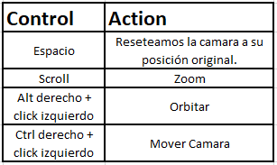

# TiminingTest
Este repositorio contiene todo lo necesario para el correcto funcionamiento de los requerimientos de Timining.

Unity versión: 2020.3.2f1 LTS.
Plataforma de compilado: PC Standalone

Cada script viene documentado función por función.

El proceso de obtención de la data, ocurre en 3 scripts:
Request Terrain => Obtiene el modelo. 
Shovel Manager => Obtiene los datos de los shovels. Ademá s es el encargado de instanciar los addressbles dentro de la escena. 
Report Manager => Obtiene los datos de los reportes. 

El proyecto posee addressables, para obtener un mejor rendimiento al momento de instanciar los objetos en la escena.

También añadi una opción para trabajar desde editor, por lo cual esta presente una carpeta llamada StreamingAssets, en donde tengo
alojado los JSON de Shovels y Reportes.

Atajos de la camara:

Assets usados:
Shovel 3D Model: https://assetstore.unity.com/packages/3d/props/realistic-shovel-clean-179431
Skybox: https://assetstore.unity.com/packages/2d/textures-materials/sky/cope-free-skybox-pack-22252

Repositorios:

Object Importer: https://github.com/PhalanxHead/UnityRuntimeOBJLoaderDocs
SimpleJSON: https://wiki.unity3d.com/index.php/SimpleJSON
MaxCamera: https://github.com/jjhesk/unity-interview/blob/master/Assets/Plugins/reusable/camera/maxCamera.cs
